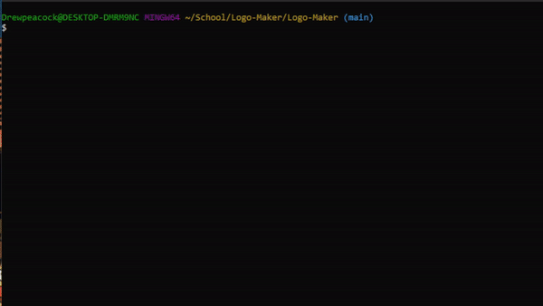
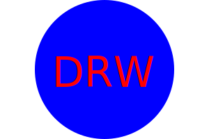

# Logo Maker
Makes a simple logo incredibly quickly from a series of user inputs.

## Description
This application allows the user to follow a series of prompts that will then create a logo.svg file that the user can use as a logo.

## Table of Contents
- [Installation](#installation)
- [Usage](#usage)
- [Tests](#tests)
- [License](#license)
- [Questions](#questions)

## Installation
This Application requires [Nodejs](https://nodejs.org/) to be installed.
 
 Once you have downloaded this repository to your local machine, navigate within the command line to the folder that contains "index.js". 
 Once there type in "npm install" to the install the required dependancy inquirer and the developer dependency jest 

## Usage
Once you have finished the installation process you can start the program by typing "node index.js" from the command line.
  
To complete the series of prompts the user needs to type in the information for each section and hit enter to move onto the next prompt. 
  
The shape section requires the use of the arrows keys to navigate the list. Use the up and down arrow keys and then enter to choose the shape of your logo
  

The following image demonstrates an example user going through the prompts provided by this application

Once you have completed all the prompts you will see the message "Generated logo.svg!".
  
You will then find a file called "logo.svg" within the same directory where you downloaded this repository. This is the file that was created from the user inputted information.

The following is an example logo that was created using this application which can also be found within the assets folder of this repository under assets/sameple-logo.svg.

## Tests
This application can be tested by entering "npm test" into the command line. There are two tests for each of the three shapes triangle, square, and circle.
  
The first test per object checks if its created the correct object with the correct color
  
The second test per object checks if its created with the correct text color and the corresponding text inputted by the user.
  
Below is an example of a user going using the test command.

## License
This project is licensed under the MIT license.

## Questions
If you have any questions, please feel free to reach out to me at my GitHub: [drewhermanson](https://github.com/drewhermanson)
or by email: drew.hermanson@gmail.com
